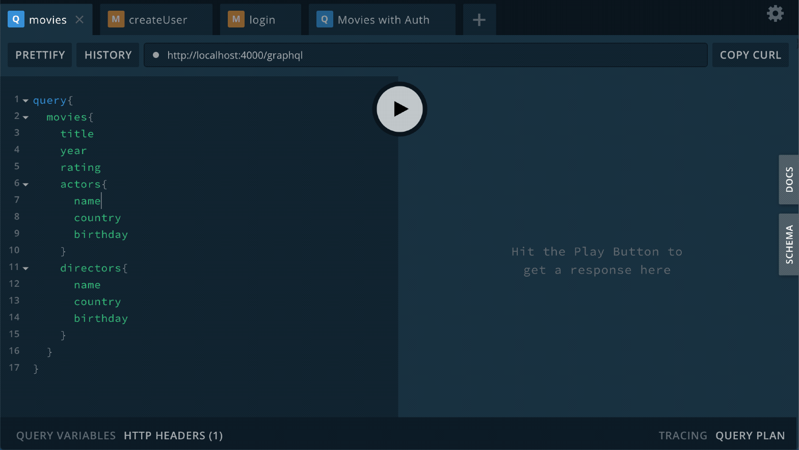

Tech Stack
-
- Apollo GraphQL with Express
- Knex with Postgres
- JSON Web Token

Demo
-



# Pre-reqs
To build and run this app locally you will need:
- Install [Node.js](https://nodejs.org/en/)
- Install [Postgres](https://www.postgresql.org/download/) or use DBaaS such as [Heroku](http://heroku.com/)
- Install [Yarn](https://yarnpkg.com/en/docs/install) or [NPM](https://docs.npmjs.com/cli/install)


# Getting started
- Clone the repository
```
git clone https://github.com/cnazha/scoutbase.git <project_name>
```
- Install dependencies
```
cd <project_name>/back-end
yarn
```
- Create a .env.development from .env.sample
```
cp .env.sample .env.development
```
>**Remember to change the values to your needs**
- Add your DB connection URL to .env.development
```
DB_PG_URL=postgresql://[user[:password]@][netloc][:port][/dbname][?param1=value1&...]
```
- Initialize DB to perform migration and load seed data
```
yarn run db:init:dev
```
- Start server in development mode
```
yarn run dev
```
